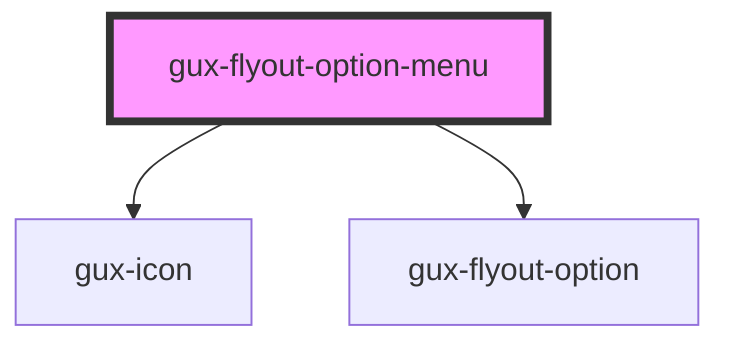

# gux-flyout-option-menu

<!-- Auto Generated Below -->

## Properties

| Property         | Attribute          | Description | Type      | Default                 |
| ---------------- | ------------------ | ----------- | --------- | ----------------------- |
| `hasInnerOption` | `has-inner-option` |             | `boolean` | `undefined`             |
| `iconName`       | `icon-name`        |             | `string`  | `'angle-right'`         |
| `name`           | `name`             |             | `string`  | `'default name'`        |
| `secondName`     | `second-name`      |             | `string`  | `'default second name'` |
| `withIcon`       | `with-icon`        |             | `boolean` | `undefined`             |

## Dependencies

### Depends on

- [gux-icon](../../../stable/gux-icon)
- [gux-flyout-option](../gux-flyout-option)

### Graph

----------------------------------------------

*Built with [StencilJS](https://stenciljs.com/)*
