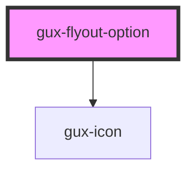

# gux-flyout-option

<!-- Auto Generated Below -->

## Properties

| Property        | Attribute         | Description | Type      | Default          |
| --------------- | ----------------- | ----------- | --------- | ---------------- |
| `iconName`      | `icon-name`       |             | `string`  | `'angle-right'`  |
| `keyCode`       | `key-code`        |             | `string`  | `undefined`      |
| `name`          | `name`            |             | `string`  | `'default name'` |
| `secondKeyCode` | `second-key-code` |             | `string`  | `undefined`      |
| `shortCut`      | `short-cut`       |             | `string`  | `undefined`      |
| `thirdKeyCode`  | `third-key-code`  |             | `string`  | `undefined`      |
| `withIcon`      | `with-icon`       |             | `boolean` | `undefined`      |

## Events

| Event           | Description | Type               |
| --------------- | ----------- | ------------------ |
| `shortcutEvent` |             | `CustomEvent<any>` |

## Dependencies

### Depends on

- [gux-icon](../../../stable/gux-icon)

### Graph

----------------------------------------------

*Built with [StencilJS](https://stenciljs.com/)*
