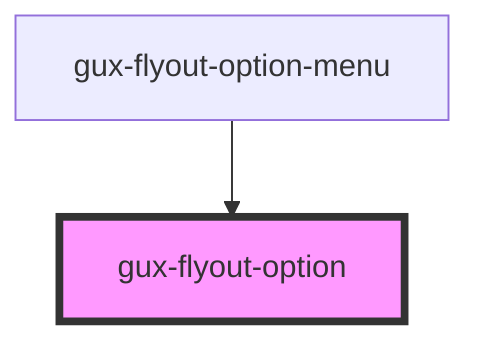

# gux-flyout-option

<!-- Auto Generated Below -->

## Properties

| Property | Attribute | Description                                                                                                                                                                                             | Type     | Default     |
| -------- | --------- | ------------------------------------------------------------------------------------------------------------------------------------------------------------------------------------------------------- | -------- | ----------- |
| `text`   | `text`    | The content of this attribute represents the value to be displayed, If this attribute is omitted, the value is taken from the text content of the slot. This attribute takes precedence over slot value | `string` | `undefined` |
| `value`  | `value`   |                                                                                                                                                                                                         | `string` | `undefined` |

## Events

| Event             | Description                             | Type                  |
| ----------------- | --------------------------------------- | --------------------- |
| `onFocus`         | Occurs when the item has been focused.  | `CustomEvent<string>` |
| `selectedChanged` | Occurs when the item has been selected. | `CustomEvent<string>` |

## Dependencies

### Used by

 - [gux-flyout-option-menu](../gux-flyout-option-menu)

### Graph

----------------------------------------------

*Built with [StencilJS](https://stenciljs.com/)*
