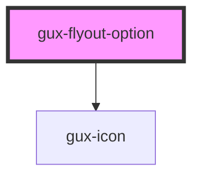

# gux-flyout-option

<!-- Auto Generated Below -->

## Properties

| Property   | Attribute   | Description | Type      | Default          |
| ---------- | ----------- | ----------- | --------- | ---------------- |
| `iconName` | `icon-name` |             | `string`  | `'angle-right'`  |
| `name`     | `name`      |             | `string`  | `'default name'` |
| `shortCut` | `short-cut` |             | `string`  | `undefined`      |
| `withIcon` | `with-icon` |             | `boolean` | `undefined`      |

## Dependencies

### Depends on

- [gux-icon](../../../stable/gux-icon)

### Graph

----------------------------------------------

*Built with [StencilJS](https://stenciljs.com/)*
