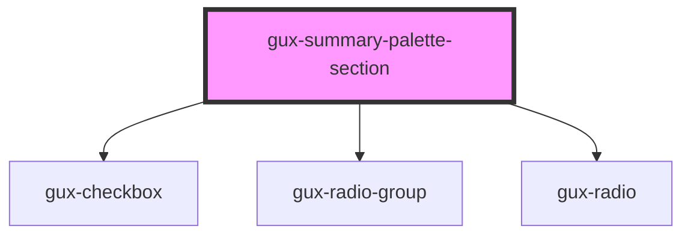

# gux-summary-palette-section

<!-- Auto Generated Below -->

## Properties

| Property   | Attribute   | Description | Type      | Default     |
| ---------- | ----------- | ----------- | --------- | ----------- |
| `checkBox` | `check-box` |             | `string`  | `undefined` |
| `options`  | `options`   |             | `boolean` | `false`     |

## Dependencies

### Depends on

- [gux-checkbox](../../../stable/gux-checkbox)
- [gux-radio-group](../../../stable/gux-radio-group)
- [gux-radio](../../../stable/gux-radio)

### Graph

----------------------------------------------

*Built with [StencilJS](https://stenciljs.com/)*
