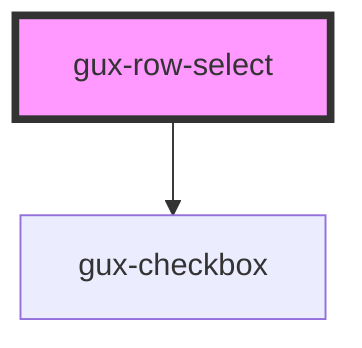

# gux-row-select

<!-- Auto Generated Below -->

## Events

| Event       | Description | Type               |
| ----------- | ----------- | ------------------ |
| `selectRow` |             | `CustomEvent<any>` |

## Dependencies

### Depends on

- [gux-checkbox](../../../stable/gux-checkbox)

### Graph

----------------------------------------------

*Built with [StencilJS](https://stenciljs.com/)*
