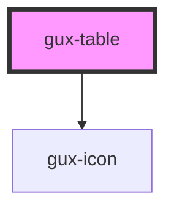

# gux-table

<!-- Auto Generated Below -->

## Properties

| Property           | Attribute           | Description                                                             | Type      | Default     |
| ------------------ | ------------------- | ----------------------------------------------------------------------- | --------- | ----------- |
| `columnOrder`      | `column-order`      | Indicates columns in order they should be displayed                     | `string`  | `undefined` |
| `compact`          | `compact`           | Indicates table row density style                                       | `boolean` | `false`     |
| `emptyMessage`     | `empty-message`     | Represents info message that should be displayed for empty table        | `string`  | `undefined` |
| `objectTable`      | `object-table`      | Indicates that object table specific styles should be applied           | `boolean` | `false`     |
| `resizableColumns` | `resizable-columns` | Indicates that table should have resizable columns                      | `boolean` | `undefined` |
| `selectableRows`   | `selectable-rows`   | Indicates that additional column for rows selection should be displayed | `boolean` | `false`     |

## Events

| Event              | Description                                               | Type               |
| ------------------ | --------------------------------------------------------- | ------------------ |
| `selectionChanged` | Triggers when table row was selected/unselected           | `CustomEvent<any>` |
| `sortChanged`      | Triggers when the sorting of the table column is changed. | `CustomEvent<any>` |

## Dependencies

### Depends on

- [gux-icon](../../stable/gux-icon)

### Graph

----------------------------------------------

*Built with [StencilJS](https://stenciljs.com/)*
